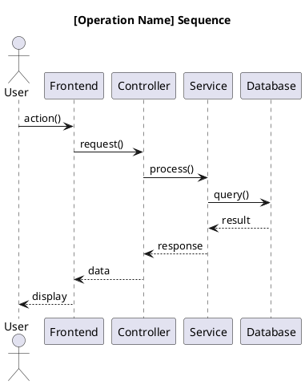
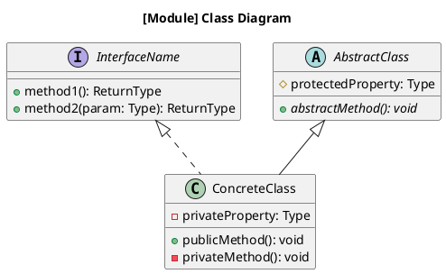
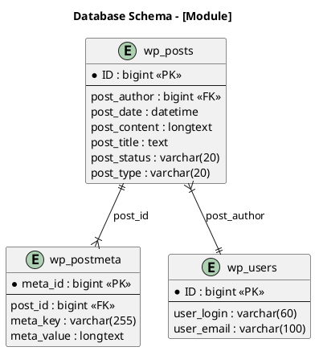

# Architecture Extraction Prompt

Use this prompt to extract and document architecture from existing code using C4 model diagrams.

## Input Template

```
EXTRACTION TARGET: [Module/Component/System]

## Scope
- Directory/Files: [paths]
- Focus Area: [specific aspect]
- Depth: [System/Container/Component/Code]

## Questions to Answer
1. [Question 1]
2. [Question 2]
3. [Question 3]

## Output Requirements
- [ ] C4 Diagrams (specify levels)
- [ ] Sequence Diagrams
- [ ] Class Diagrams
- [ ] ERD
- [ ] Design Pattern Documentation
```

## Expected Output

### 1. C4 Model Diagrams

#### System Context (Level 1)
```plantuml
@startuml
!include https://raw.githubusercontent.com/plantuml-stdlib/C4-PlantUML/master/C4_Context.puml

title System Context - [System Name]

Person(user, "User", "Description")
System(system, "System", "Description")
System_Ext(external, "External System", "Description")

Rel(user, system, "Uses")
Rel(system, external, "Calls")

@enduml
```

#### Container Diagram (Level 2)
```plantuml
@startuml
!include https://raw.githubusercontent.com/plantuml-stdlib/C4-PlantUML/master/C4_Container.puml

title Container Diagram - [System Name]

Person(user, "User")

System_Boundary(wp, "WordPress") {
    Container(frontend, "Frontend", "PHP/JS", "User interface")
    Container(backend, "Backend", "PHP", "Business logic")
    Container(api, "REST API", "PHP", "API endpoints")
    ContainerDb(db, "Database", "MySQL", "Data storage")
}

Rel(user, frontend, "Uses", "HTTPS")
Rel(frontend, backend, "Calls")
Rel(backend, api, "Uses")
Rel(backend, db, "Reads/Writes")

@enduml
```

#### Component Diagram (Level 3)
```plantuml
@startuml
!include https://raw.githubusercontent.com/plantuml-stdlib/C4-PlantUML/master/C4_Component.puml

title Component Diagram - [Container Name]

Container_Boundary(container, "Container") {
    Component(comp1, "Component 1", "Class", "Description")
    Component(comp2, "Component 2", "Class", "Description")
    Component(comp3, "Component 3", "Interface", "Description")
}

Rel(comp1, comp2, "Uses")
Rel(comp2, comp3, "Implements")

@enduml
```

### 2. Sequence Diagrams


### 3. Class Diagrams


### 4. ERD


## WordPress Architecture Extraction Examples

### Extract REST API Architecture
```
EXTRACTION TARGET: REST API System

## Scope
- Directory/Files: wp-includes/rest-api/
- Focus Area: Endpoint registration and routing
- Depth: Component

## Questions to Answer
1. How are REST endpoints registered?
2. What is the request lifecycle?
3. How is authentication handled?

## Output Requirements
- [x] C4 Component Diagram
- [x] Sequence Diagram (request lifecycle)
- [x] Class Diagram (controllers)
```

### Extract Hook System Architecture
```
EXTRACTION TARGET: Hook System (Actions/Filters)

## Scope
- Directory/Files: wp-includes/plugin.php
- Focus Area: Event system pattern
- Depth: Code

## Questions to Answer
1. How are hooks registered?
2. How are hooks executed?
3. What is the priority system?

## Output Requirements
- [x] Component Diagram
- [x] Sequence Diagram
- [x] Design Pattern Documentation (Observer)
```

## Usage

```
@lead-Solution_Architect Extract architecture:

EXTRACTION TARGET: WP_Query System

## Scope
- Directory/Files: wp-includes/class-wp-query.php, wp-includes/query.php
- Focus Area: Query building and execution
- Depth: Component/Code

## Questions to Answer
1. How does WP_Query parse arguments?
2. What is the SQL generation process?
3. How does caching integrate?

## Output Requirements
- [x] C4 Component Diagram
- [x] Sequence Diagram (query execution)
- [x] Class Diagram (WP_Query)
- [x] Design Pattern Documentation
```

## Agent Workflow

1. **@lead-Solution_Architect** - High-level architecture extraction
2. **@senior-Software_Architect** - Detailed code analysis, pattern identification
3. **@senior-Technical_Writer** - PlantUML diagram creation, documentation
